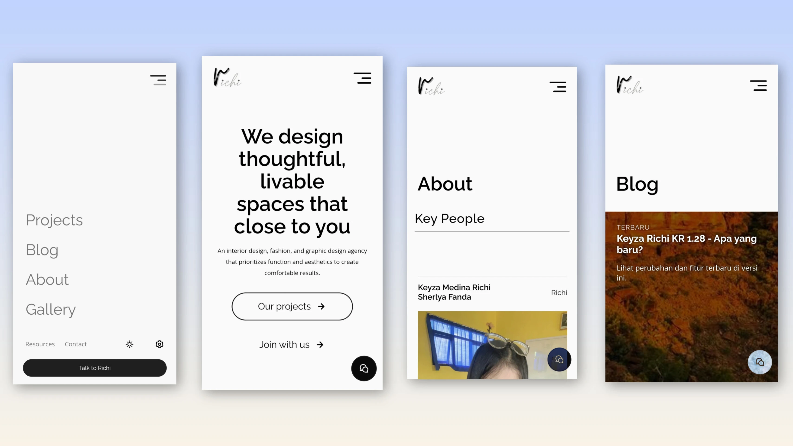

# Keyza Richi

Creative agency website focused on interior, fashion, and graphic experiences.

🌐 Live Demo:
https://yuukiconan.github.io/Keyza-Richi

---

## Preview

  

---

## Features

- Responsive design
- Smooth scrolling
- People cards with dialog bio
- Optimized performance
- Minimalist Rave UI system

---

## Tech Stack

- HTML
- CSS
- JavaScript
- GitHub Pages

---

## Lighthouse Score

Desktop: 99  
Mobile: 84

---

## Roadmap

- Rave UI Corporate
- School redesign demo
- Thumbnail downloader tool

---

## Author
Yuuki Conan (me)
